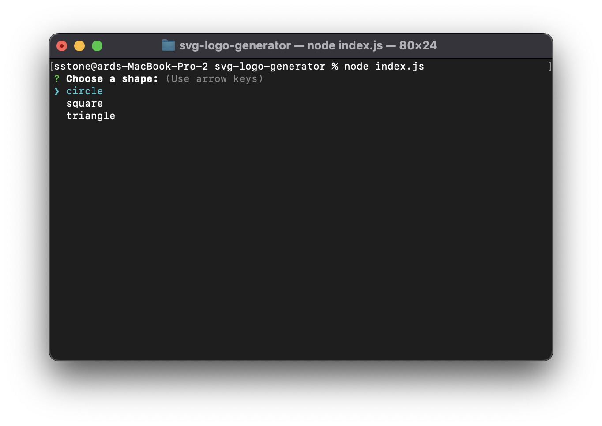
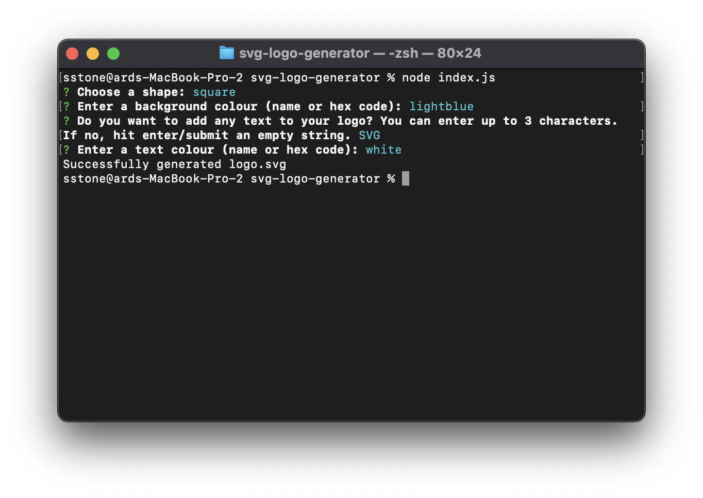
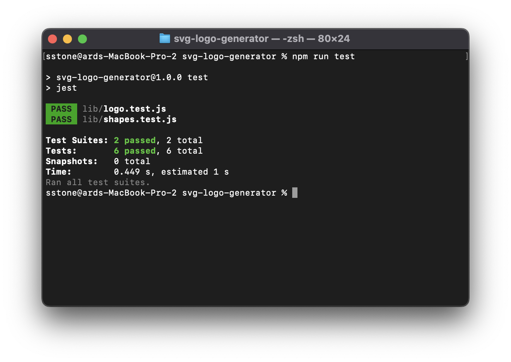

# SVG Logo Generator

## Description

This application generates a new svg file of a custom logo based on user input.

The inquirer library is used to prompt the user to choose a shape (out of circle, square, and triangle), provide a colour name or hex code for the background, provide optional text for the logo, and provide the text colour as a name or hex code. A new Logo object is then created and a new Shape object is created within the Logo class based on the selection. I.e. if the user selected "circle" then a new Circle class object is initalized and set to the shape attribute of the logo class. The object's colour, text, and textColour attributes are set according to the user's input. If no text is provided, the text attribute is set to an empty string.

To produce the svg file, the object's `createSvgFile` method is called, which in turn calls the `generateTextElement` and `createSvgElements` methods of the logo class and the `generateElement` of the shape's class. After these methods are executed, a string is returned with the necessary information to produce an svg. This string is then written to the file "logo.svg" in the "examples" folder using the `fs` library.

During this project, I became more familiar with object-oriented programming and classes. Additionally, this is my first experience using `Jest` and writting tests for my application, and I learned a lot about the testing process.

## Table of Contents

- [Installation](#installation)
- [Usage](#usage)
- [Credits](#credits)
- [License](#license)

## Installation

To install this application, follow these steps:

1. Download the set of files and folders in the <a href="https://github.com/stms15/svg-logo-generator">GitHub repo</a>. The minimum requirements are `index.js`, `lib`, `examples`, `package.json`, and `package-lock.json`.

2. Open your terminal or a text editor with a terminal and navigate to the folder with the application files.

3. Run `node i` or `node install` to install all of the required packages listed in the `package.json` file.

4. Now you're ready to use the application.

## Usage

To use this application, in the terminal, naviagte to the directory with the files and run `node index.js`. You will be prompted with a serious of questions about your desired logo. You first have to choose a shape from the provided list.

You can enter a colour name or hex code for the background colour and text colour and up to 3 characters of text to place on your logo. If you don't want any text, just click enter/submit an empty string. When all of the prompts are answered, the svg file will be created. If no errors occured, you will receive a "Successfully generated logo.svg" message in the terminal.

The generated logo can be found in the `examples` folder titled `logo.svg`. Here's an example of what the logo will look like based on the input provided in the screenshots above.

You can find more sample logos that can be created using this application in the `examples` folder or here: https://drive.google.com/drive/folders/1Ast7R_3Ga5NxGpX6A7hZaonkJvjBN-Um?usp=drive_link.

For a full walkthrough video on how to use this application, please see this video for details: https://drive.google.com/file/d/12cjU7PrJ2-XbAA1nZwAAvDYRnokMoV-7/view?usp=drive_link.

## Credits

The following W3 Schools website was referenced for generating the code needed to produce an svg image: https://www.w3schools.com/graphics/svg_rect.asp.

## License

For more information about this license, please see the `LICENSE` file or visit https://spdx.org/licenses/MIT.html.

---

## Badges

## Tests

There are two test Jest files for this application: `shapes.test.js` and `logo.test.js`.

The `shapes.test.js` file tests the `setColour` method of each shape class (Circle, Square, Triangle). The `logo.tests.js` file tests the `setText`, `setTextColour`, and `createSvgElements` methods of the Logo class.

To run these tests, type `npm run test` in the terminal. Your terminal should look like the following after execution if the tests were successful.

